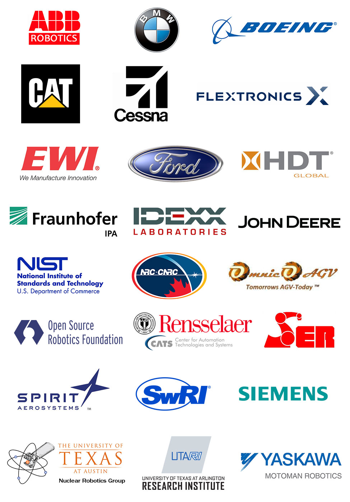
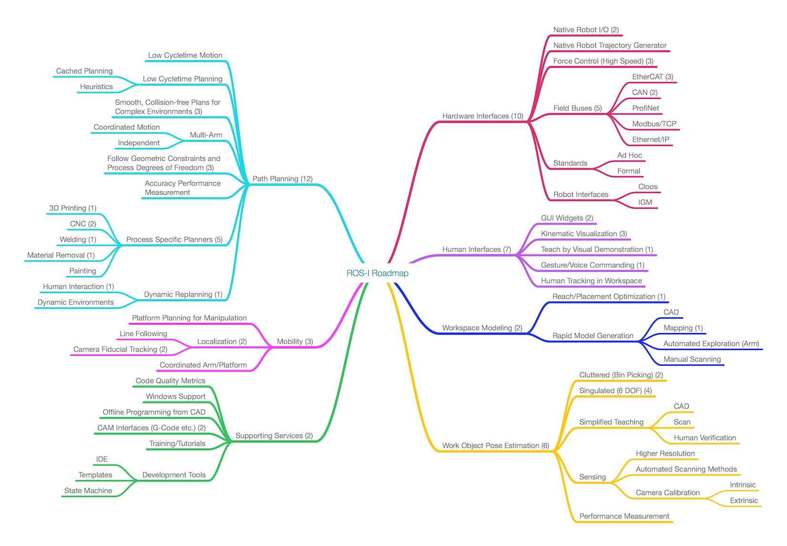
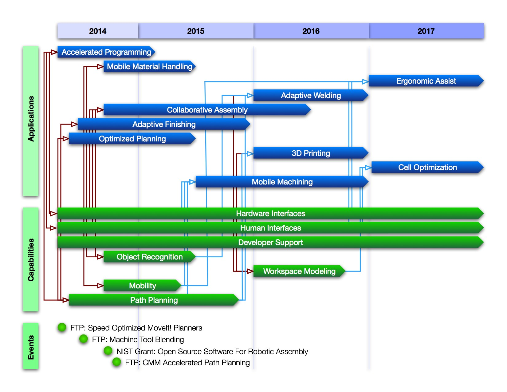

# ROS-Industrial Consortium Roadmapping

## Summary
To do

## Purpose
This document summarizes the ROS-Industrial Consortium (RIC) Americas efforts to provide a technical roadmap for the ROS-Industrial open source project.  It consolidates the input of nearly two dozen member organizations and other contributors that met in person and virtually during 2014.  The roadmap attempts to identify technical needs based on end-user requirements for automation and robotics.  Given these needs, the capabilities of the ROS-Industrial project can be mapped and gaps identified.  Ultimately, this roadmap can then be used to allocate resources to address these gaps.

## Scope
The scope has been limited to potential ROS-Industrial end-user needs, as expressed by the consortium members, and does not directly address developer, integrator or other stakeholders needs.  It is prioritized based on feedback from current ROS-Industrial Consortium members, but may be revised as additional members join the consortium and additional user needs are identified.  It is envisioned as a living document that requires periodic updates.  The process is intentionally limited to addressing technical needs, although some non-technical requirements such as training and documentation have been identified.  Specific implementation or development plans are also avoided since these may be dependent on funding sources and participating organizations.

## Process
The process roughly follows the [Sandia National Lab Fundamentals of Roadmapping](SandiaFundamentalsOfRoadmapping.pdf) technique.  In summary, the steps include:

1. Define the scope and participants
2. Create a common vision for the product/technology
3. Identify stakeholder requirements
4. Define technology areas
5. Identify alternatives and gaps
6. Recommend path(s) forward
7. Evaluate roadmap
8. Develop implementation plans

### 1. __Define Scope and Participants__
See above for scope and RIC member participants.  I would also like to highlight our European partners in particular TU Delft and Fraunhofer IPA.

### 2. Create a Common Vision for the Product/Technology
This document does not attempt to take ownership of the ROS-Industrial Project vision; instead one might look towards the [project website](http://rosindustrial.org), or more broadly, [ROS.org](http://ros.org).  The following is offered to gain alignment and a common language:

__Vision:__ ROS-Industrial provides an open and flexible framework for manufacturing automation development that:

* Enables cross-platform compatibility  
* Creates new applications that were previously infeasible or impractical
* Advances manufacturing productivity
* Improves worker well being
* Motivates students and researchers to focus on industrial problems 
* Reduces implementation costs
* Foster growth of commercial developments

### 3. Identify Stakeholder requirements
This was accomplished through a use case elicitation process, which is summared in the [Use Cases](UseCases.md).  Ten broad use cases were identified.

### 4. Define Technology areas
The technology areas were extracted from the [Use Cases](https://github.com/ros-industrial-consortium/roadmapping/blob/master/UseCases.md) and then defined through a series of [virtual brainstorming meetings](https://github.com/ros-industrial-consortium/roadmapping/tree/master/Meetings).  The result is summarized in the mind map below.

One can observe that the areas were categorized into six technical subtopics and one non-technical topic (Supporting Services).  The numbers in parenthesis represent the number of use-cases that have needs in these areas.  The topic areas are:

1. __Hardware Interfaces:__ new interfaces to other robot controllers, sensors and actuators
2. __Human Interfaces:__ new ways to interact with humans by "traditional" means such as graphical interfaces or non-traditional means such as gesture commands
3. __Workspace Modeling:__ rapid generation of environment models and how to configure the robot within those environments
4. __Work-Object Pose Estimation:__ identification and locating known objects in unknown locations (unstructured)
5. __Path Planning:__ determining optimal motion plans for a robot manipulator while obeying process constraints
6. __Mobility:__ topics unique to mobile platforms including localization and navigation
7. __Support Services:__ developer and user support such as training and documentation

The technology areas (capabilities) mapped against the use cases (applications) and schedules are show in the graphic below:

The events shown in the above graphic have direct impact on the application areas and will result in development within many of the capabilities areas.  The red connector lines represent concurrent development activities between projects and the capabilities.  The blue lines represent dependencies between technologies and their application.

### 5. Identify Alternatives and Gaps
The summaries above provide a high level overview of the needs and potential technology solutions.  In reality, each application will have detailed requirements that need to be mapped against features and performance of various tools within the ROS-Industrial community.  This section attempts to define more specifically some of those needs.

#### 5.1 Path Planning

The path planning subtopic is a cross-cutting and high priority need for the ROS-Industrial community.  Although the broader ROS community continues to focus significant efforts in this area, many of the problems that are of interest to researchers and "field" roboticists involve operation in highly unstructured domains.  These environments are characterized by clutter, uncertainty, and lack of _a priori_ knowledge.  Most industrial applications are afforded more structure such as conveyors, fixturing, and static workcells.  Thus, industrial users expect higher performance as measured by cycle time, reliability, and determinism, at the expense of ability to accomodate greater uncertainty in the environment.

##### Alternatives
There are many competing alternatives for articulated arm path planning that include:

* [MoveIt!](http://moveit.ros.org): The MoveIt! framework is actually a higher level construct that provides the facilities for various path planning codes.
* [OMPL](http://ompl.kavrakilab.org): OMPL is library of sampling-based planners that are the defaults for ROS.
* [SBPL](http://wiki.ros.org/sbpl): The search-based planning library is a graph search framework.
* [OpenRave](http://openrave.org): OpenRave is a full environment for planning and simulation including a plug-in architecture for other codes.
* [CHOMP](http://wiki.ros.org/chomp_motion_planner): Optimization based planners.
* [Orocos/KDL](http://www.orocos.org/kdl): Orocos is a larger framework for robot control including state estimation and realtime components.  KLDL provides kinematics solvers including trajectory planners.

Most of these alternatives are actually frameworks or libraries that permit extension and adaptation for varied planning algorithms.  As such, all could be employed for ROS-Industrial applications.  However, MoveIt! is the leading framework within the ROS community moving forward.  Consequently, it is the recommended development environment.

##### Gaps
Among these frameworks, numerous planning algorithms are possible, but most are inappropriate for industrial problems.  For example, the [RRT](http://en.wikipedia.org/wiki/Rapidly_exploring_random_tree) (Rapidly-Exploring Random Tree) algorithm is a common sampling-based planner that efficiently searches through high dimensional configuration spaces to find planning solutions.  It can do so while handling geometric constraints.  However, it fundamentally searches for a single goal state from an initial state.  This may be acceptable for some material handling applications where only one pick and place location is needed, but many industrial processes have requirements for following an entire Cartesian path with known accuracy.  An example is a welding application where the robot is required to follow a known position trajectory, perhaps with some flexibility in the weld gun orientation.  In general, industrial path planners have the following desirable features:

* Able to follow arbitrary Cartesian paths with known accuracies (not just end goals)
* Able to permit flexible orientation for some orientation degrees of freedom, generally within process limits
* Able to constrain velocities along the Cartesian path
* Able to plan collision free trajectories along the entire path

None of the known path planners directly provide this set of capabilities and this is a significant barrier for implementing ROS-Industrial applications for processes such as painting, welding, material removal, deposition and other path-based plans.  Note that there is ongoing work within the ROS-Industrial Community to address some of these needs including an [optimizing inverse kinematics trajectory planner](http://wiki.ros.org/industrial_moveit) and a [hybrid Cartesian planner](https://github.com/ros-industrial-consortium/descartes).

In addition, several other needs were identified such as multi-arm coordinated planning and cycle-time optimized planning.  Both of these are addressed in some capacity [here](https://github.com/ros-industrial/motoman/tree/hydro-devel/motoman_sda10f_support) for dual arm Motoman support and [here](http://static.squarespace.com/static/51df34b1e4b08840dcfd2841/t/53c3435ce4b00a24507b341d/1405305692771/IDEXX_Planning_Presentation.pdf) for cycle-time optimized planning.  More work is require to broaden and generalize these solutions.

In summary, path planning is cross-cutting need (nearly all the use cases have driving requirements) and there is significant opportunity to make a contributions to these goals.  This need is a high priority for ROS-industrial users.  

#### 5.2 Mobility
Mobility is an increasingly important topic to industrial users.  Automated Guided Vehicles have been in use commercially for years and initially they were relatively inflexible, following predefined paths and only accommodating static environments.  More recently, advanced systems have been deployed that are able to reliably navigate in dynamic environments and along varied paths.  Fully unconstrained navigation in dynamic and human-trafficked is an uncommon capability and very few industrial mobile manipulators have been commissioned.  These are capabilities that the ROS community has been addressing since the beginning and therefore ROS-Industrial is poised to make significant contributions.

##### Alternatives
Mobile navigation is really a combination of multiple technologies that include mapping, localization, path planning, and control.  The [ROS Navigation Stack](http://wiki.ros.org/navigation) is the _de facto_ standard for this collection of capabilities.  In practice each subtopic may be uniquely configured and many alternative packages exist.  As an example, we might just look at a few of the simultaneous localization and mapping codes (SLAM):

* [Gmapping](http://wiki.ros.org/gmapping)
* [Hector SLAM](http://wiki.ros.org/hector_slam)
* [RTAB-MAP (RGB-D SLAM)](https://code.google.com/p/rtabmap/)
* [RATSLAM](https://code.google.com/p/ratslam/wiki/RatSLAMROS)
* many more...

##### Gaps

SLAM methods are inherently probabilistic.  As such, they are subject to errors that can be large especially in highly dynamic maps.  Such a scenario is unacceptable in most industrial applications that demand very high reliability.  Consequently, industrial users have sought to add structure to the localization problem to improve determinism.  Early AGVs used painted lines or wires on the floors to positively localize (and path plan).  To improve flexibility, newer methods are being explored and one that shows promise is a [NAV350 laser scanning navigation sensor from SICK](https://www.mysick.com/PDF/Create.aspx?ProductID=75430&Culture=en-US).  This product uses targets mounted in the facility to enable high-accuracy and high-reliability localization.

The mapping problem include the creation of static maps and addressing dynamic obstacles within the static environment.  SLAM codes such as Gmapping adequately address static map creation.  However, the representation of dynamic object is a complex one and an area of research.  For example, should the robot try to predict the future state of the dynamic object?  What about human interaction?  In some cases simple behaviors may be implemented to avoid some of these problems, for example, pausing motion while dynamic obstacles are present.

Similarly, path planning in an industrial environment still presents research challenges.  For some benign application, such as holonomic platforms that are approximately circular, the combination of the [navfn global planner](http://wiki.ros.org/navfn?distro=indigo) and the [dwa_local_planner](http://wiki.ros.org/dwa_local_planner?distro=indigo) adequately address unconstrained navigation.  Other applications such as Ackerman steered vehicles are less well supported.  Industrial mobile manipulators must also plan for the best base location to conduct the manipulation process.  This, too, is a relatively open problem.

The control problem tends to be hardware-specific and there are tools within the Community such as [ROS_Control](http://wiki.ros.org/ros_control) to assist.  One interesting control problem is that of coordination of the mobile base with the manipulator.  This application is not well supported currently and will likely include both hardware and software solutions.

In summary, the ROS community has a diverse toolkit to address mobility, however the expectations of industrial users present several problems that are still unsolved.

#### 5.3 Hardware Interfaces
One of the original motivations for the ROS-Industrial project was to address hardware interfaces to common industrial systems including robots, controllers, sensors, and actuators.

##### Alternatives
There are not many alternatives to address this problem.  There are standards such as [EtherCAT](http://www.ethercat.org) and [OPC-UA](https://opcfoundation.org/about/opc-technologies/opc-ua/) that provide common frameworks for communicating between systems, but ROS support for many of the common protocols and networks is limited.  The robot client-server framework requires custom development for each new robot.  Existing hardware support is listed [here](http://wiki.ros.org/Industrial/supported_hardware).  

##### Gaps
Several gaps were directly identified by members and include support for Cloos and IGM robots, most field buses, and broadly force control techniques.  In addition, some existing hardware interfaces can benefit from commonization, testing, and performance improvements.

#### 5.4 Human Interfaces
Similar to hardware interfaces, industrial users have unique expectations for human interfaces.  The term HMI (human-machine interface) is often used to represent a graphical touch screen device that is used to command the robot or machine.  Many commercial products exist to create these HMIs and they typically include libraries for connecting to PLCs and higher-level factory information systems.

##### Alternatives
In the ROS Community, there are not direct analogs to the commercial HMI offering.  However several alternatives exist:

* [rqt](http://wiki.ros.org/rqt) - ROS Qt (rqt) is a ROS framework that builds on the [Qt framework](http://qt-project.org) for developing native user Interfaces
* [ROSbridge](http://wiki.ros.org/rosbridge_suite) - ROSbridge provides a JSON protocol and implementation for communicating between ROS and non-ROS systems such as web servers.

In addition to PC-based GUIs, ROS provides capacity for other interesting human interfaces such as [gesture recognition](http://wiki.ros.org/rtcus_kinect_gestures) and [speech recognition](http://wiki.ros.org/pocketsphinx).  

##### Gaps
Even though tools like rqt and ROSbridge are highly flexible, that flexibility comes at a cost in development time.  Most commercial HMI toolkits have templates and standard controls for the common needs.  These don't exist today within ROS-Industrial.  In addition, as described in the hardware interfaces, the HMIs must connect to common industrial hardware and significant gaps exist in these areas.  That being said, ROS-Industrial provides uncommon capabilities, for example the Rviz tool which, among other capabilities, permits viewing real sensor data with simulated robots.

#### 5.5 Workspace Modeling
Workspace modeling includes the generation of 3D virtual representations of the robot and its environment, tools, and other non-dynamic components.  These representations are critical for visualization, simulation, and collision modeling.  In a mobility application this representation is abstracted into a cost map.  In manipulation applications, full 3D models are needed, and in some cases, multiple representations are needed for collision modeling and visualization.

Workspace modeling also involves the design or layout of the workcell.  Importantly, the location of the robot and workpiece are often critical factors in the dexterity and cycle time of an application.  Optimization of this layout is potentially of high value.

##### Alternatives
There are two primary methods to generate these models: CAD data and sensor data.  Sensor data can be further separated into prior knowledge (maps etc.) and real-time data.  Each can be considered separately:

* __CAD__ The [Uniform Robot Description Format (URDF)](http://wiki.ros.org/urdf) is the specification for how to represent robots and static objects from CAD.  The format presents semantic information about the object including joint locations and types and geometry files.  There is a [SolidWorks exporter tool](http://wiki.ros.org/sw_urdf_exporter) that automateds much of this process for parts and assemblies.
* __Static Sensor Data__ Static sensor data is often used in mobility applications and is represented in a cost map layer as part of the Navigation Stack.  There is no direct way to represent 3D data in a static scene other than converting it to a URDF.
* __Dynamic Sensor Data__ Dynamic or real-time sensor data is often populated into an [occupancy grid](http://wiki.ros.org/occupancy_grid_utils) for 2D data or [Octomap](http://wiki.ros.org/octomap) for 3D data.

For the workspace analysis an [experimental package](https://github.com/ros-planning/moveit_advanced/tree/hydro-devel/moveit_workspace_analysis) exists, but it is not well supported yet.

##### Gaps
As mentioned above, the URDF and associated geometry files (collada format) are the primary interface for static scene modeling.  Although the SolidWorks exporter aids significantly, there is still a lot of manual manipulation required to generate complex assemblies and often additional work is required for collision models which are generally simplified.  There is an opportunity to further automated these processes and also support other CAD software or a common intermediate file format.

One could also imagine a tool to scan a workspace and automatically generate a model file.  Techniques such as [KinFu](http://pointclouds.org/documentation/tutorials/using_kinfu_large_scale.php) might be applicable for the task.

Finally, additional development and testing is needed for a reliable workspace modeling tool.

#### 5.6 Work Object Pose Estimation
The goal of the pose estimation problem is to locate the workpiece in the frame of reference of the robot for manipulation.  Traditionally, this problem is solved via fixturing, but this solution negates the advantages of a programmable robot.  2D vision systems have become commonplace over the two decades.  Under controlled situations, 2D vision can accurately locate uncertain objects.  Typically, lighting and the geometric structure of the problem must be managed; clutter and low-contrast situations are challenging.  3D imaging methods overcome some of these issues by enabling the use of shape to identify and locate objects.  However, the methods to effectively utilize both 2D and 3D imaging to improve pose estimation are still nascent.

##### Alternatives
There are two primary perception libraries used by the ROS community: [OpenCV](http://opencv.org) for 2D and [PCL](http://pointclouds.org) for 3D.  Both have become powerful, fast, and flexible tools for sensor processing.  For example, OpenCV provides many [template matching](http://docs.opencv.org/doc/tutorials/imgproc/histograms/template_matching/template_matching.html) approaches.  And, PCL has group of [object recognition tools](http://docs.pointclouds.org/trunk/group__recognition.html).  In addition there are several commercial packages that could be integrated within a ROS-Industrial application; the most prominent being [MVTec Halcon](http://www.halcon.com)

##### Gaps
Object pose estimation, especially in cluttered, poorly lit, or occluded applications requires significant engineering and present uncertain outcomes.  Although these are difficult research problems, many libraries and algorithms are being developed.  Unlike many other technology areas, the ROS-Industrial community is not unique in their requirements here, and can therefore leverage much of the broader community's work.  A significant gap exists however in understanding the performance of these various algorithms in different applications.  One could envision a comprehensive evaluation of current state-of-the-art algorithms on a set of common industrial problems in pose estimation.

#### 5.7 Support Services
The support services cover an important class of non-technical activities that will foster the growth and application of ROS-Industrial.  These topics are essentially all gaps or opportunities in the community and include:

* Better Code Quality Metrics
* Windows Support
* Training and Tutorials
* Developer Support Such as Templates
* Ongoing Roadmapping Such as This Effort

### 6. Recommendations and Priorities

#### 6.1 Hardware Interfaces
To Do

#### 6.2 Human Interfaces
To Do

#### 6.3 Workspace Modeling
The ROS-Industrial Consortium is addressing the Workspace Modeling topic via a series of five milestone projects known as the CAD to ROS Workbench. Here we provide a roadmap for the future objectives of each milestone. Each milestone is anticipated to have a duration of four months.

##### Milestone 1: URDF GUI Editor 
* Open and edit new or existing URDFs and xacros 
* Add an existing URDF or xacro to a second URDF or xacro 
* Add/modify parent-child relationships in a tree structure with GUI controls 
* Add/modify tool flange and tool center point (TCP) locations 
* Edit link and joint properties with GUI controls 
* Display changed properties instantly in the 3D environment (no need to reload the 3D environment from the command line) 
* Import/add STL, Collada, and STEP for individual parts (assemblies will treated as a single part for this milestone)
* Create collision geometry (i.e. convex hulls) for individual part files 
* Hide/display geometry and origins

##### Milestone 2: Process Planning
* Create/define a new ROS message for Cartesian process trajectories: CartesianProcessTrajectory 
* Import Cartesian tool paths/waypoints, tolerances, sensor action tags, and process I/O tags from CSV, Apt, or STEP-NC file to a ROS CartesianProcessTrajectory message 
* Add/edit CartesianProcessTrajectory waypoints using GUI controls 
* (Desired) Create new CartesianProcessTrajectory paths from simple CAD features: flat surfaces, edges, holes 
* (Desired) Import Cartesian tool paths from G-code. Note that this is considered a legacy support capability since STEP-NC is superseding G-code. 
* (Desired) Export CartesianProcessTrajectory paths to CSV, Apt, STEP-NC and G-code 

##### Milestone 3: Work Cell Planning
* Create a graphical library from which to drag and drop kinematic chains (i.e. robots) into a work cell URDF 
* Support GUI-drag/rotate capability for kinematic chains to position a chain in the 3D environment window 
* Create a workspace analysis tool: Map the reach/dexterity of a serial chain throughout its 3D workspace 
* Create/store a list of seeds for KDL to ensure a comprehensive solution space is available to MoveIt! planners 
* Create a robot base pose optimization tool to recommend a robot mounting position, given its CartesianProcessTrajectory 
* Integrate the MoveIt! Setup Assistant and export to SRDF 
* (Desired) Expand the definition of URDF to include parallel kinematic chains 
* (Desired) Expand MoveIt! to natively support parallel kinematic chains 
* (Desired) Import kinematic chains from Collada and STEP-NC 

##### Milestone 4: Sensor Configuration and Calibration Setup
* Create a graphical library from which to drag and drop 2D and/or 3D imaging sensors and calibration targets into the 3D environment
 * Populate the library with existing sensor configuration packages o Populate the library with existing calibration target models 
 * Update sensor models to include Field of View geometry 
 * Enable the perspective to snap to the sensor point of view 
 * Configure sensor parameters such as IP address, frame rate, and data window size with GUI controls 
* Create intrinsic calibration sequences for individual sensors using a GUI interface
* Create extrinsic calibration sequences for multiple heterogeneous sensors, synchronized with robot motion and/or synchronized with calibration target motion using a GUI interface. Unique GUIs will be created for four typical use cases: 
 * Single sensor mounted on the robot’s wrist 
 * Static stereo pair of sensors mounted a fixed distance apart 
 * Static array of sensors mounted throughout the work cell and the calibration target mounted on the robot 
 * Static array of sensors mounted throughout the work cell and calibration target mounted on a conveyor 
* (Desired) Create extrinsic calibration sequences for a sensor using features of opportunity in the environment (i.e. without a calibration target) 
* (Desired) Create a launch file editor and analyzer to enable graphical representation of launch file structure and dependencies 

##### Milestone 5: 3D Point Cloud Importer
*Import and manipulate point cloud data within ROS from a GUI 
* Create/fit primitives including planes, spheres, cylinders, rectangular solids, and pyramids to segments in the point cloud (human-guided GUI interaction) 
* Designate point cloud segments as collision geometry 
* ICP-fit/overlay one point cloud on another point cloud – filtering, segmentation, feature recognition, pose estimation, etc.

#### 6.4 Work-Object Pose Estimation
To Do

#### 6.5 Path Planning
To Do

#### 6.6 Mobility
To Do

#### 6.7 Support Services
To Do
