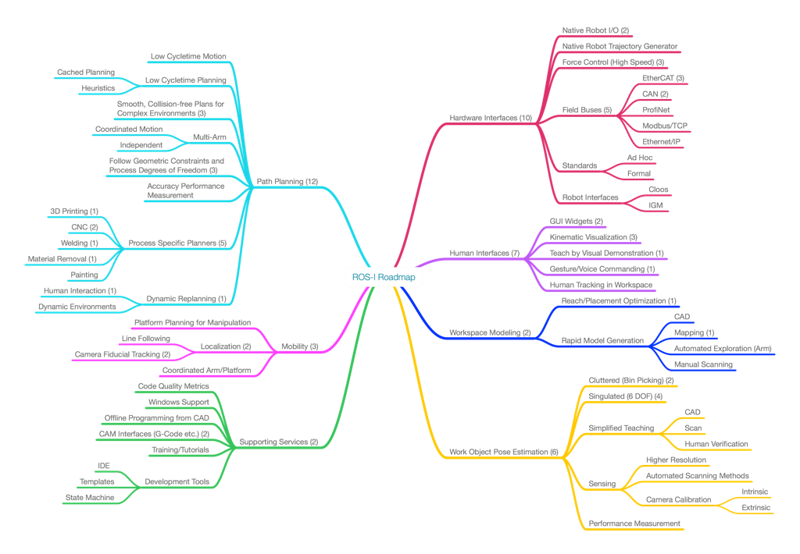

# ROS-Industrial Consortium Roadmapping

## Purpose
This document summarizes the ROS-Industrial Consortium (RIC) Americas efforts to provide a technical roadmap for the ROS-Industrial open source project.  It consolidates the input of nearly two dozen member organizations that met in person and virtually during 2014.  The roadmap attempts to identify technical needs based on end-user requirements for automation and robotics.  Given these needs, the capabilities of the ROS-Industrial project can be mapped and gaps identified.  Ultimately, this roadmap can then be used to allocate resources to address these gaps.

## Scope
The scope has been limited to potential ROS-Industrial end-user needs, as expressed by the consortium members, and does not directly address developer, integrator or other stakeholders needs.  It is prioritized based on feedback from current ROS-Industrial Consortium members, but may be revised as additional members join the consortium and additional user needs are identified.  It is envisioned as a living document that requires periodic updates.  The process is intentionally limited to addressing technical needs, although some non-technical requirements such as training and documentation have been identified.  Specific implementation or development plans are also avoided since these may be dependent on funding sources and participating organizations.

## Process
The process roughly follows the [Sandia National Lab Fundamentals of Roadmapping](SandiaFundamentalsOfRoadmapping.pdf) technique.  In summary, the steps include:

1. Define the scope and participants
2. Create a common vision for the product/technology
3. Identify stakeholder requirements
4. Define technology areas
5. Identify alternatives and gaps
6. Recommend path(s) forward
7. Evaluate roadmap
8. Develop implementation plans

    ### 1. __Define Scope and Participants__
See above for scope and RIC member participants

    ### 2. Create a Common Vision for the Product/technology
This document does not attempt to take ownership of the ROS-Industrial Project vision; instead one might look towards the [project website](http://rosindustrial.org), or more broadly, [ROS.org](http://ros.org).  The following is offered to gain alignment and a common language:

    __Vision:__ ROS-Industrial provides an open and flexible framework for advanced robotics development that:

    * Enables cross-platform compatibility  
    * Creates new applications that were previously infeasible or impractical
    * Advances manufacturing productivity
    * Improves worker well being
    * Motivates students and researchers to focus on industrial problems 
    * Reduces implementation costs
    * Foster growth of commercial developments
    
    ### 3. Idenfity Stateholder requirements
This was accomplished through a use case elicitation process, which is summared in the [Use Cases](UseCases.md).

    ### 4. Define Technology areas
The technology areas were extracted from the [Use Cases](UseCases.mb) and then defined through a series of [virtual brainstorming meetings](https://github.com/ros-industrial-consortium/roadmapping/tree/master/Meetings).  The result is summarize in the mind map below.

    One can observe that the areas were categorized into six technical subtopics and one non-technical topic (Supporting Services).  The numbers in parethesis represent the number of use-cases that have needs in these areas.  The  topic areas are:

    1. Hardware Interfaces: new interfaces to other robot contorllers, sensors and actuators
    2. Human Interfaces: new ways to interact with humans by "traditional" means such as graphical interfaces or non-traditional means such as gesture commanads
    3. Workspace Modeling: rapid generation of environement models and how to configure the robot within those environements
    4. Work-Object Pose Estimation: identification and locating known objects in unknown locations (unstructured)
    5. Path Planning: determining optimal motion plans for a robot manipulator while obeying process constraints
    6. Mobility: topics unique to mobile platforms including localization and navigation
    7. Support Services: developer and user support such as training and documentation
    
    